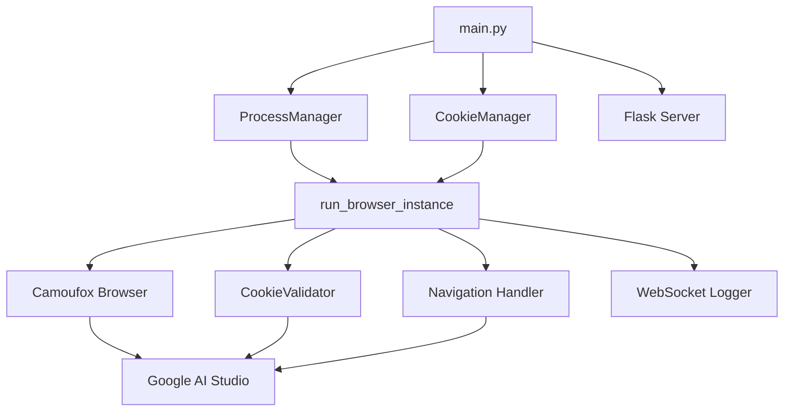

# AIStudioBuildWS - 系统架构

## 整体架构

```
┌──────────────────────────────────────────────────────────────┐
│                      AIStudioBuildWS                          │
├──────────────────────────────────────────────────────────────┤
│  main.py                                                      │
│  ├── ProcessManager (进程管理)                                │
│  │   ├── 跟踪所有浏览器进程                                   │
│  │   ├── 优雅终止进程                                         │
│  │   └── 信号处理 (SIGTERM/SIGINT)                           │
│  │                                                            │
│  ├── start_browser_instances()                               │
│  │   ├── 加载配置 (load_instance_configurations)             │
│  │   └── 为每个 Cookie 启动独立进程                          │
│  │                                                            │
│  ├── run_standalone_mode() - CLI 独立模式                    │
│  └── run_server_mode() - Flask 服务器模式 (HuggingFace)      │
│                                                               │
├──────────────────────────────────────────────────────────────┤
│  browser/                                                     │
│  ├── instance.py                                              │
│  │   └── run_browser_instance() - 单个浏览器实例生命周期     │
│  │       ├── 加载 Cookie                                      │
│  │       ├── 导航到目标 URL                                   │
│  │       ├── 验证登录状态                                     │
│  │       ├── 挂载 WebSocketLogger (可开关)                    │
│  │       └── 进入保活循环                                     │
│  │                                                            │
│  ├── navigation.py                                            │
│  │   ├── handle_untrusted_dialog() - 处理弹窗                │
│  │   └── handle_successful_navigation() - 保活循环           │
│  │                                                            │
│  ├── ws_logger.py                                             │
│  │   └── WebSocketLogger - 记录 WebSocket 通信 (需开关开启)  │
│  │                                                            │
│  └── cookie_validator.py                                      │
│      └── CookieValidator - 定期验证 Cookie 有效性            │
│                                                               │
├──────────────────────────────────────────────────────────────┤
│  utils/                                                       │
│  ├── cookie_manager.py                                        │
│  │   ├── CookieSource - Cookie 来源数据类                    │
│  │   └── CookieManager - 统一管理 Cookie 检测和加载          │
│  │                                                            │
│  ├── cookie_handler.py                                        │
│  │   ├── convert_cookie_editor_to_playwright()               │
│  │   ├── convert_kv_to_playwright()                          │
│  │   └── auto_convert_to_playwright() - 自动格式转换         │
│  │                                                            │
│  ├── logger.py - 日志配置                                     │
│  ├── paths.py - 路径管理 (logs_dir, cookies_dir)             │
│  ├── common.py - 通用工具函数                                 │
│  └── url_helper.py - URL 处理和脱敏                          │
└──────────────────────────────────────────────────────────────┘
```

## 源码路径

```
f:/AIStudioBuildWS/
├── main.py                    # 主入口，进程管理，Flask 服务器
├── browser/
│   ├── instance.py            # 浏览器实例管理
│   ├── navigation.py          # 页面导航和保活
│   ├── ws_logger.py           # WebSocket 日志记录
│   └── cookie_validator.py    # Cookie 验证
├── utils/
│   ├── cookie_manager.py      # Cookie 来源管理
│   ├── cookie_handler.py      # Cookie 格式转换
│   ├── logger.py              # 日志配置
│   ├── paths.py               # 路径管理
│   ├── common.py              # 通用工具
│   └── url_helper.py          # URL 处理
├── cookies/                   # Cookie JSON 文件存放目录
├── logs/                      # 日志和截图输出目录
├── Dockerfile                 # Docker 镜像构建
├── docker-compose.yml         # Docker Compose 配置
├── docker-compose.override.yml # 本地开发覆盖配置
├── requirements.txt           # Python 依赖
├── .env.example               # 环境变量示例
└── README.md                  # 项目文档
```

## 关键技术决策

### 1. 多进程架构
- 使用 `multiprocessing` 而非 `threading`
- 每个 Cookie/账户运行在独立进程中
- 通过 `multiprocessing.Event` 实现跨进程关闭信号

### 2. 反检测浏览器
- 使用 Camoufox（基于 Firefox 的反检测浏览器）
- 支持三种运行模式：headless / virtual / 有界面

### 3. Cookie 管理
- 支持两种 Cookie 来源：JSON 文件和环境变量
- 支持两种 Cookie 格式：Cookie-Editor JSON 和 KV 字符串
- 自动格式检测和转换

### 4. 部署模式
- **独立模式**：直接运行 `python main.py`
- **服务器模式**：`HG=true` 时启动 Flask，提供健康检查端点

## 组件关系



## 设计模式

1. **工厂模式**：`CookieManager.load_cookies()` 根据来源类型创建不同的加载策略
2. **观察者模式**：`shutdown_event` 用于通知所有子进程优雅关闭
3. **单例模式**：`process_manager` 作为全局进程管理器

## 关键实现路径

### 启动流程
1. `main()` → 注册信号处理器
2. `run_standalone_mode()` / `run_server_mode()`
3. `start_browser_instances()` → 加载配置
4. `multiprocessing.Process(target=run_browser_instance)` → 启动子进程

### Cookie 加载流程
1. `CookieManager.detect_all_sources()` → 扫描文件和环境变量
2. `CookieManager.load_cookies()` → 从指定来源加载
3. `auto_convert_to_playwright()` → 转换为 Playwright 格式

### 保活流程
1. `handle_successful_navigation()` → 进入保活循环
2. 每 10 秒点击页面
3. 每 360 次点击（1 小时）执行 Cookie 验证
4. 检测到关闭信号时优雅退出