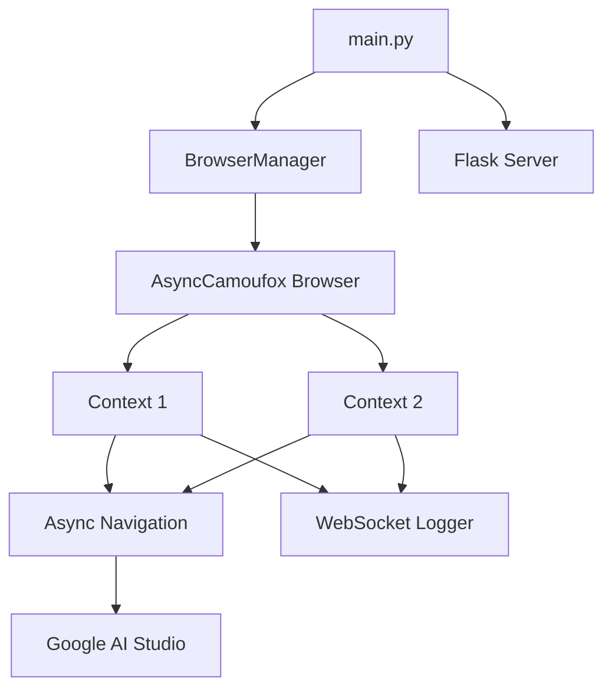

# AIStudioBuildWS - 系统架构

## 整体架构

```
┌──────────────────────────────────────────────────────────────┐
│                      AIStudioBuildWS                          │
├──────────────────────────────────────────────────────────────┤
│  main.py                                                      │
│  ├── Global Variables (shutdown_event, browser_manager)       │
│  ├── run_standalone_mode() - CLI 独立模式                    │
│  │   └── run_async_manager()                                 │
│  ├── run_server_mode() - Flask 服务器模式                    │
│  │   └── Thread(target=run_async_manager)                    │
│  └── signal_handler()                                        │
│                                                               │
├──────────────────────────────────────────────────────────────┤
│  browser/                                                     │
│  ├── manager.py                                               │
│  │   └── BrowserManager (单例)                               │
│  │       ├── run() - 异步主循环                              │
│  │       │   ├── 启动 AsyncCamoufox 实例                     │
│  │       │   └── 为每个配置创建 Context Task                 │
│  │       └── run_context() - 单个 Context 生命周期           │
│  │           ├── 加载 Cookie                                 │
│  │           ├── 创建 BrowserContext                         │
│  │           ├── 导航到目标 URL                              │
│  │           ├── 挂载 WebSocketLogger                        │
│  │           └── 调用 async_navigation                       │
│  │                                                            │
│  ├── async_navigation.py                                      │
│  │   ├── handle_untrusted_dialog() - 异步处理弹窗            │
│  │   └── handle_successful_navigation() - 异步保活循环       │
│  │                                                            │
│  └── ws_logger.py                                             │
│      └── WebSocketLogger - 记录 WebSocket 通信               │
│                                                               │
├──────────────────────────────────────────────────────────────┤
│  utils/                                                       │
│  ├── cookie_manager.py                                        │
│  │   ├── CookieSource - Cookie 来源数据类                    │
│  │   └── CookieManager - 统一管理 Cookie 检测和加载          │
│  │                                                            │
│  ├── cookie_handler.py                                        │
│  │   ├── convert_cookie_editor_to_playwright()               │
│  │   ├── convert_kv_to_playwright()                          │
│  │   └── auto_convert_to_playwright() - 自动格式转换         │
│  │                                                            │
│  ├── logger.py - 日志配置                                     │
│  ├── paths.py - 路径管理 (logs_dir, cookies_dir)             │
│  ├── common.py - 通用工具函数                                 │
│  └── url_helper.py - URL 处理和脱敏                          │
└──────────────────────────────────────────────────────────────┘
```

## 源码路径

```
f:/AIStudioBuildWS/
├── main.py                    # 主入口，Flask 服务器，异步循环启动器
├── browser/
│   ├── manager.py             # 浏览器管理器 (AsyncCamoufox)
│   ├── async_navigation.py    # 异步页面导航和保活
│   └── ws_logger.py           # WebSocket 日志记录
├── utils/
│   ├── cookie_manager.py      # Cookie 来源管理
│   ├── cookie_handler.py      # Cookie 格式转换
│   ├── logger.py              # 日志配置
│   ├── paths.py               # 路径管理
│   ├── common.py              # 通用工具
│   └── url_helper.py          # URL 处理
├── cookies/                   # Cookie JSON 文件存放目录
├── logs/                      # 日志和截图输出目录
├── Dockerfile                 # Docker 镜像构建
├── docker-compose.yml         # Docker Compose 配置
├── docker-compose.override.yml # 本地开发覆盖配置
├── requirements.txt           # Python 依赖
├── .env.example               # 环境变量示例
└── README.md                  # 项目文档
```

## 关键技术决策

### 1. 单进程多上下文架构 (Asyncio)
- **旧架构**: 多进程 (multiprocessing)，每个账号一个浏览器进程。资源消耗大。
- **新架构**: 单进程 (asyncio)，使用 `AsyncCamoufox`。
  - **Single Browser Instance**: 共享浏览器二进制和主进程，大幅降低内存。
  - **Multiple Contexts**: 使用 `browser.new_context()` 实现账号隔离。
  - **Async/Await**: 高效处理 I/O 密集型任务 (网络请求、等待)。

### 2. 反检测浏览器
- 使用 Camoufox（基于 Firefox 的反检测浏览器）
- 支持三种运行模式：headless / virtual / 有界面

### 3. Cookie 管理
- 支持两种 Cookie 来源：JSON 文件和环境变量
- 支持两种 Cookie 格式：Cookie-Editor JSON 和 KV 字符串
- 自动格式检测和转换

### 4. 部署模式
- **独立模式**：直接运行 `python main.py`，启动 asyncio loop。
- **服务器模式**：`HG=true` 时启动 Flask，在后台守护线程中运行 asyncio loop。

## 组件关系



## 设计模式

1. **单例模式**：`BrowserManager` 在应用中仅存在一个实例。
2. **异步任务模式**：每个 Browser Context 作为一个独立的 `asyncio.Task` 运行。
3. **工厂模式**：`CookieManager` 负责加载和转换 Cookie。
